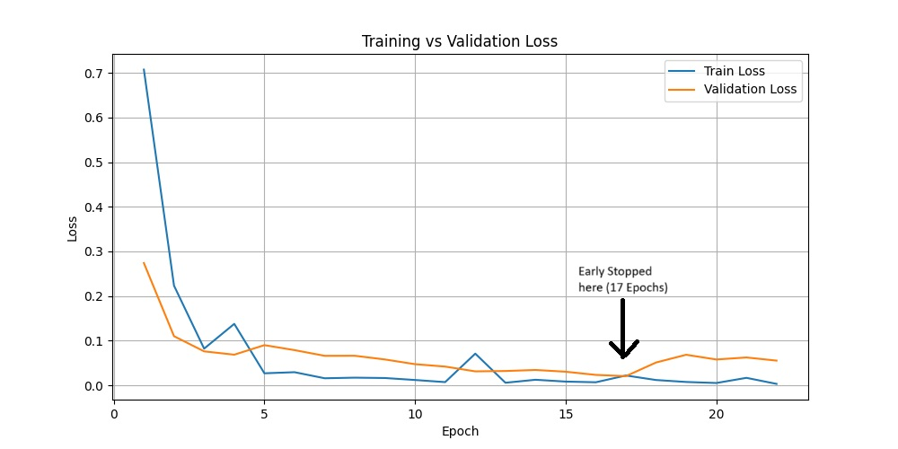
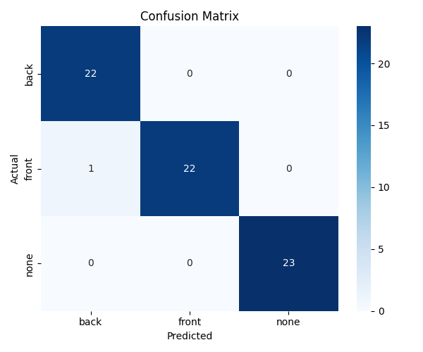

# Phone View Classifier

A PyTorch-based deep learning project that classifies images of phones into **`front`**, **`back`**, or **`none`** (objects that are not phones). This repository includes training, evaluation, and inference scripts along with metric visualizations.

## Project Structure

```
.
├── README.md
├── metrics/
│   ├── final_classification_report.json
│   ├── final_confusion_matrix.png
│   └── loss_plot.jpg
├── requirements.txt
├── Data/
│   ├── front/
│   ├── back/
│   └── none/
├── test_images/
├── src/
│   ├── __init__.py
│   ├── download_none_images.py
│   ├── inference.py
│   └── train.py
└── weights/
    └── model.pth
```

---

## Setup Instructions

### 1. Clone the Repository

```bash
git clone https://github.com/your-username/phone-view-classifier.git
cd phone-view-classifier
```

### 2. Create Virtual Environment & Install Dependencies

```bash
python -m venv venv
source venv/bin/activate      # On Windows: venv\Scripts\activate
pip install -r requirements.txt
```

---

## Model Overview

- Architecture: ResNet-18
- Classes: `front`, `back`, `none`
- Transfer Learning: Uses pretrained weights
- Loss: CrossEntropyLoss
- Optimizer: Adam
- Augmentations: Random flip, rotation, color jitter

---

## Training the Model

Make sure your dataset is placed under `Data/front`, `Data/back`, and `Data/none`.

Then run:

```bash
python src/train.py
```

This will:
- Split data into train, validation, and test
- Train the model with early stopping
- Save:
  - `weights/model.pth`
  - `metrics/loss_plot.jpg`
  - `metrics/final_confusion_matrix.png`
  - `metrics/final_classification_report.json`

---

## Inference

To classify a single image:

```bash
python src/inference.py --image-path test_images/sample.jpg
```

Expected output:

```
✅ Predicted class: front, Confidence Score: 0.987
```

---

## Download "None" Class Data 

To download synthetic "none" class images (non-phone handheld objects):

```bash
python src/download_none_images.py
```

---

## Metrics and Evaluation

After training, evaluation artifacts are stored in the `metrics/` directory:

- `final_classification_report.json` – F1-score and per-class performance
- `loss_plot.jpg` – Training vs validation loss curve
- `final_confusion_matrix.png` – Confusion matrix heatmap

---

## Training Loss Curve



---

## Confusion Matrix



---

## Evaluation Results

After training, the model was evaluated on the test set with the following results:

**Overall Accuracy**: `98.53%`  
**Weighted F1-Score**: `0.9853`

**Per-Class Performance**:

| Class | Precision | Recall | F1-Score | Support |
|-------|-----------|--------|----------|---------|
| back  | 0.9565    | 1.0000 | 0.9778   | 22      |
| front | 1.0000    | 0.9565 | 0.9778   | 23      |
| none  | 1.0000    | 1.0000 | 1.0000   | 23      |


---


## Example Results

| Image                         | Predicted | Confidence |
|------------------------------|-----------|------------|
| `test_images/phones56.png`| `back`   | 0.87       |
| `test_images/phones42.png` | `front`    | 0.97       |
| `test_images/photo-1546519638-68e109498ffc.jpg`     | `none`    | 0.94       |

---

---

## 🧠 Model Selection Justification: Why ResNet-18?

This project uses **ResNet-18**, a convolutional neural network from the Residual Network family, specifically designed to address vanishing gradient problems in deeper architectures. Here's a detailed justification:

### 🔬 Architectural Advantages of ResNet-18

- **Residual Connections (Skip Connections)**: 
  ResNet-18 introduces identity mappings via skip connections, allowing gradients to flow directly across layers during backpropagation. This mitigates vanishing/exploding gradient issues, stabilizing training even as network depth increases.

- **Shallow Depth for Efficient Convergence**:  
  With 18 layers, ResNet-18 is deep enough to capture complex features but not excessively over-parameterized. This ensures:
  - Faster convergence
  - Lower memory footprint
  - Reduced overfitting risk on small/medium datasets

- **Batch Normalization**:  
  Present after each convolution, it normalizes intermediate activations, improving generalization and allowing higher learning rates.

---


### 🧪 Dataset Characteristics & Model Suitability

- **Dataset Size**: Small-to-medium (~300–400 images total).  
  ResNet-18 is appropriate as deeper models like ResNet-50 would require more data or strong regularization to avoid overfitting.

- **Task Complexity**: Fine-grained classification of subtle differences in phone orientation (`front` vs `back`) and unrelated hand-held objects (`none`).  


- **Inference Requirements**: The goal is not just accuracy but also **real-time performance** on low-resource environments (e.g., laptops or edge devices).  
  ResNet-18 delivers a good balance of **low latency** and **high precision**.

---


## Contact

- **Name**: Amber Goswami
- **Email**: ambergoswami9@gmil.com

---